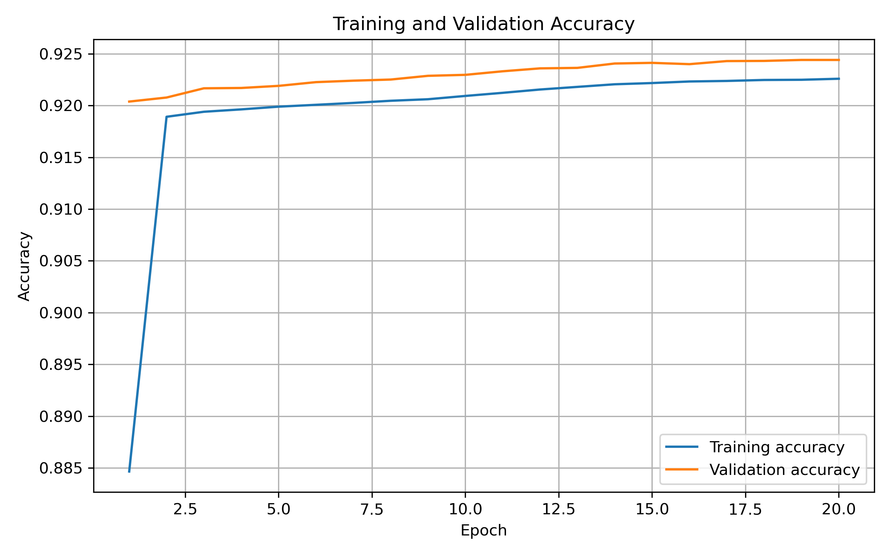
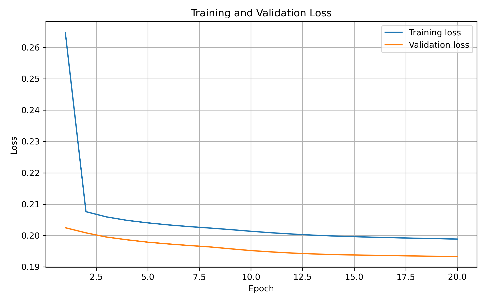

# Training Results Summary

## Model

- Model: Multilayer Perceptron (MLP)
- Input features: 3 RGB pixel intensity values
- Architecture: 3 → 128 → 64 → 2
- Hidden activation: ReLU
- Output activation: Softmax
- Loss function: Sparse categorical crossentropy
- Optimizer: Adam

## Training Configuration

- Epochs: 20
- Batch size: 2048
- Random seed: 42
- Dataset features: 3
- Feature range: 0–1
- Missing values: None

## Dataset Split

- Test set: 50% of the complete dataset
- Training and validation subset: 50% of the complete dataset
- Validation set: 10% of the training subset
- Stratified splitting: Yes

## Test Results

| Metric | Value |
|---|---:|
| Test loss | 0.1966 |
| Test accuracy | 0.9239 |
| Test accuracy (%) | 92.39% |

## Training Curves

### Accuracy

### Loss

## Reproducibility

The training process is implemented in the `src` directory.

- `train_mlp_cric.py`: Reusable training function.
- `run_training.py`: Execution script with the local dataset path.
- `plot_training.py`: Generates training and validation curves.

The dataset is not included in this repository. The training script receives the dataset path as an argument through the execution configuration.

## Notes

This project presents a simple pixel-level classification approach based exclusively on RGB intensity values. It is intended as an illustrative research and computer vision project.

The reported results correspond to a single training run using the configuration described above.