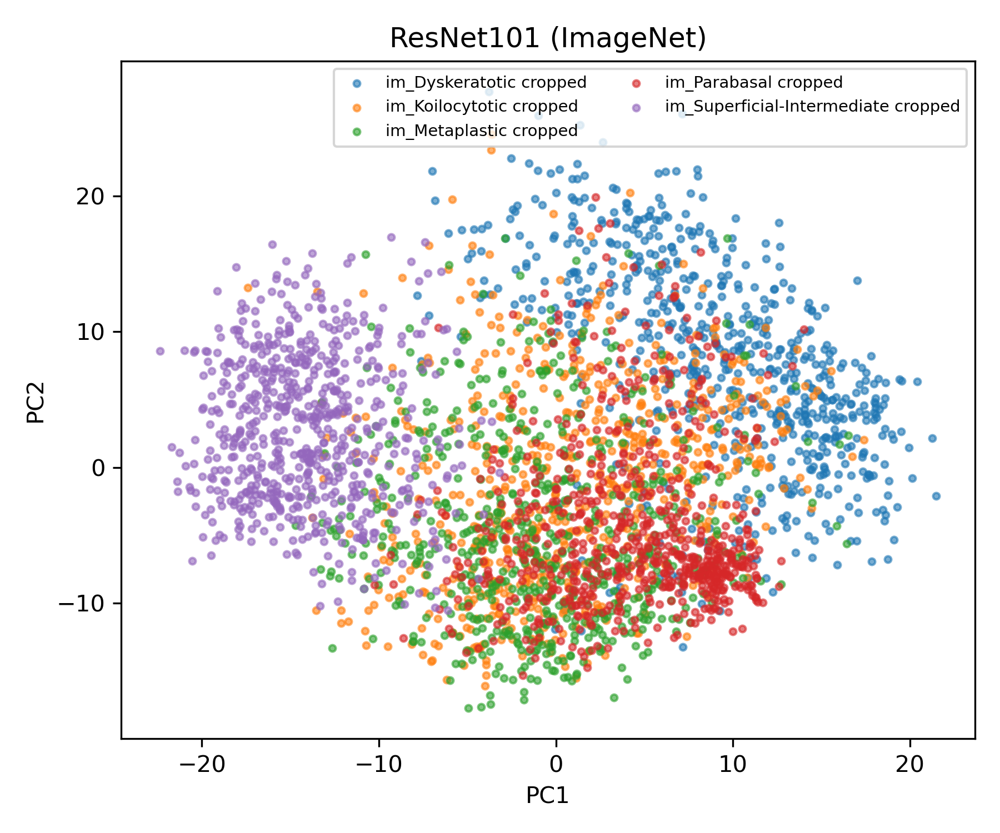
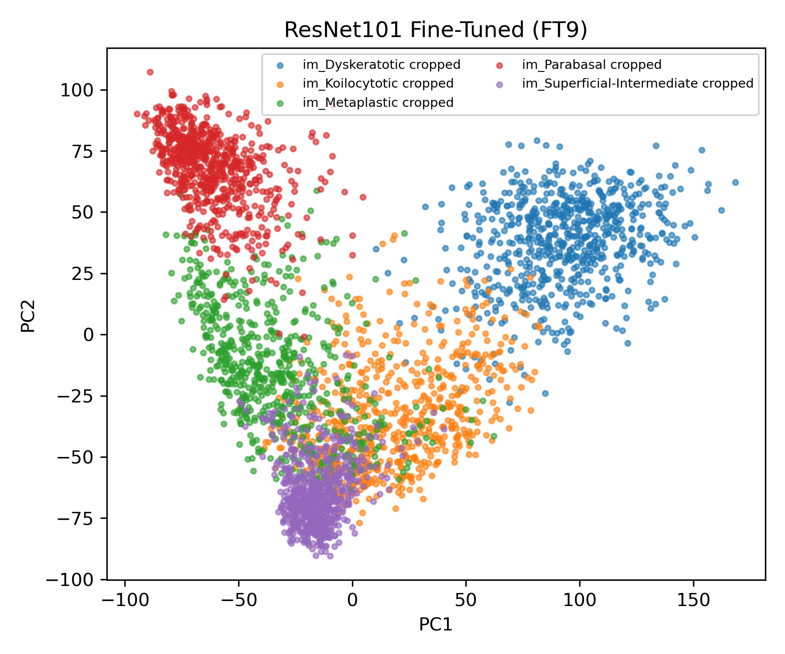

# CNN Feature Extraction and Fine-Tuning for Cervical Cell Classification

## Overview

This project presents a deep learning pipeline for feature extraction and classification of cervical cell images using convolutional neural networks (CNNs) and machine learning classifiers.

The research is based on the SIPaKMeD dataset and includes:

- Comparison of ten ImageNet-pretrained CNN architectures.
- Supervised fine-tuning using ResNet-101 through 14 configurations.
- Fine-tuning experiments using two Batch Normalization (BN) strategies: frozen BN layers and trainable BN layers.
- Ten independent repetitions of each fine-tuning configuration and BN strategy to reduce the influence of random variability.
- Knowledge distillation and supervised feature extraction.
- Conventional and hierarchical classification.
- Five-class, three-class, and binary classification scenarios.
- Balanced and imbalanced classification settings.
- External validation using the Herlev dataset.

The original experimental campaign was conducted in a high-performance computing environment. Each fine-tuning configuration was repeated ten times under the corresponding experimental setting. This repository provides a selected local implementation of the research methodology for demonstration and reproducibility purposes. It does not reproduce the complete experimental campaign or repeat the full set of historical experiments.

The objective of the public repository is to provide a manageable and understandable implementation of the main workflow, using a limited number of representative experiments and previously obtained research results where appropriate.

## Objectives

- Compare ImageNet-pretrained CNN architectures for deep feature extraction.
- Evaluate 14 supervised fine-tuning configurations using ResNet-101.
- Compare frozen and trainable Batch Normalization settings.
- Reduce the effect of random variability through ten repetitions per configuration and experimental setting in the original study.
- Extract deep feature representations for downstream classification.
- Compare supervised fine-tuning with knowledge distillation.
- Evaluate five-class, three-class, and binary classification tasks.
- Analyze balanced and imbalanced classification settings.
- Assess generalization through external validation using the Herlev dataset.
- Provide a computationally manageable local implementation.

## Datasets

### SIPaKMeD

The SIPaKMeD dataset was used for CNN architecture comparison, fine-tuning, feature extraction, and internal classification experiments.

The dataset contains five cervical cell categories:

| Cell type |
|---|
| Superficial/Intermediate |
| Parabasal |
| Metaplastic |
| Koilocytotic |
| Dyskeratotic |

The dataset contains 4,049 cell images.

To prevent data leakage, partitioning was performed at the parent-image level. Patches originating from the same parent image were assigned to the same data subset.

### Data partition

| Subset | Number of cell images | Approximate proportion |
|---|---:|---:|
| Development | 3,379 | 83.45% |
| Independent test | 670 | 16.55% |
| **Total** | **4,049** | **100.00%** |

The intended partition was approximately 85% for development and 15% for testing. Because the split was performed at the parent-image level, the final proportions were not exactly 85% and 15%.

Cross-validation was performed only on the development subset using grouped and stratified folds. The independent test subset was reserved for final evaluation and was not used for model selection in the preliminary comparisons described in this repository.

### Herlev

The Herlev dataset was used for external validation under different acquisition conditions.

The external evaluation was designed as a binary classification problem by grouping the cell categories into normal and abnormal classes. The complete external-validation campaign belongs to the original research and is not fully reproduced in the current public implementation.

## CNN Architecture Comparison

The original research evaluated ten ImageNet-pretrained CNN architectures:

| No. | CNN architecture |
|---:|---|
| 1 | ResNet-50 |
| 2 | ResNet-50V2 |
| 3 | ResNet-101 |
| 4 | ResNet-101V2 |
| 5 | ResNet-152 |
| 6 | ResNet-152V2 |
| 7 | VGG16 |
| 8 | InceptionV3 |
| 9 | MobileNetV2 |
| 10 | EfficientNetB0 |

A decoupled MLP classifier was used to evaluate the extracted feature representations.

Based on the original comparison, **ResNet-101 was selected as the reference feature extractor** for the subsequent fine-tuning experiments.

The complete ten-architecture comparison belongs to the original research campaign. The public local implementation reproduces a selected comparison between ResNet-101 and MobileNetV2.

### Local extractor comparison

The local comparison was performed on the development set using the same MLP classifier and grouped five-fold cross-validation.

| MLP component | Configuration |
|---|---|
| Hidden layer 1 | 128 neurons |
| Hidden layer 2 | 64 neurons |
| Output layer | 5 neurons |
| Cross-validation | 5-fold StratifiedGroupKFold |
| Evaluation subset | Development set |

The MLP architecture refers to the classifier layers and is independent of the dimensionality of the CNN feature vector.

| Extractor | Accuracy | Precision (macro) | Recall (macro) | Specificity (macro) | F1-score (macro) |
|---|---:|---:|---:|---:|---:|
| ResNet-101 | 0.9327 ± 0.0181 | 0.9318 ± 0.0206 | 0.9318 ± 0.0202 | 0.9831 ± 0.0045 | 0.9311 ± 0.0208 |
| MobileNetV2 | 0.9063 ± 0.0195 | 0.9061 ± 0.0200 | 0.9063 ± 0.0198 | 0.9765 ± 0.0050 | 0.9054 ± 0.0204 |

These values correspond to development-set cross-validation and should not be interpreted as independent test-set results.

The comparison results are stored in:

```text
results/mlp_extractor_comparison/mlp_extractor_comparison_fold_results.csv
results/mlp_extractor_comparison/mlp_extractor_comparison_5fold.csv
```

## Preliminary comparison: supervised fine-tuning vs. knowledge distillation

A preliminary development-set comparison was performed under the following conditions:

| Evaluation element | Configuration |
|---|---|
| Classifier | MLP |
| MLP architecture | 128 → 64 → 5 |
| Cross-validation | StratifiedGroupKFold |
| Number of folds | 5 |
| Standardization | Per fold |
| Classification task | Five-class |
| Evaluation subset | Development set |
| Independent test-set evaluation | Not included |

The feature files were:

| Feature source | File |
|---|---|
| Knowledge distillation | `FT1_KDestilation.csv` |
| Supervised fine-tuning | `features_FT1/FT1_1.csv` |

### Results

| Feature source | Accuracy | Precision (macro) | Recall (macro) | Specificity (macro) | F1-score (macro) |
|---|---:|---:|---:|---:|---:|
| Knowledge distillation | 0.9245 ± 0.0163 | 0.9235 ± 0.0134 | 0.9242 ± 0.0163 | 0.9812 ± 0.0041 | 0.9234 ± 0.0152 |
| Supervised fine-tuning | 0.9889 ± 0.0044 | 0.9886 ± 0.0041 | 0.9890 ± 0.0047 | 0.9972 ± 0.0011 | 0.9888 ± 0.0044 |

These are preliminary development-set cross-validation results. They are not independent test-set results and are reported as part of the methodological comparison.

## Fine-Tuning

A systematic fine-tuning evaluation was conducted using ResNet-101.

Fourteen configurations were evaluated by varying the number of frozen and trainable layers. The BN-related settings were evaluated separately:

| BN strategy | Description |
|---|---|
| Frozen BN | Batch Normalization layers remain frozen |
| Trainable BN | Batch Normalization layers are updated during training |

Each configuration and BN strategy was repeated ten times in the original research using different random seeds.

### Fine-tuning configurations

| Configuration | Frozen Layers | Trainable Layers | BN Layers |
|---|---:|---:|---:|
| FT1 | 324 | 21 | 6 |
| FT2 | 302 | 43 | 13 |
| FT3 | 272 | 73 | 22 |
| FT4 | 252 | 93 | 28 |
| FT5 | 222 | 123 | 37 |
| FT6 | 202 | 143 | 43 |
| FT7 | 172 | 173 | 52 |
| FT8 | 152 | 193 | 58 |
| FT9 | 122 | 223 | 67 |
| FT10 | 102 | 243 | 73 |
| FT11 | 80 | 265 | 80 |
| FT12 | 60 | 285 | 86 |
| FT13 | 50 | 295 | 95 |
| FT14 | 30 | 315 | 102 |

### Reference configuration

| Selection item | Value |
|---|---|
| Reference configuration | FT9 |
| Frozen layers | 122 |
| Trainable layers | 223 |
| BN layers | 67 |
| Selection basis | Development-validation analysis |
| Additional consideration | Balance between performance and stability |

**FT9 was selected as the reference configuration** for subsequent feature extraction and classification based on the original development-validation analysis and the balance between performance and stability.

The public repository does not repeat the complete 14-configuration × 2-BN-strategy × 10-repetition experimental campaign. Instead, it includes selected scripts and representative results to demonstrate the methodology while keeping local execution computationally manageable.

## Feature Extraction

Based on the ResNet-101 model and the selected FT9 configuration with frozen Batch Normalization (BN) layers, which was consistently supported throughout the experimental campaign, deep feature representations are extracted for both the development (DEV) and independent test (TEST) sets. These feature representations are then used as input to the final classification stage.

## PCA Visualization of Feature Representations

Principal Component Analysis (PCA) was used to visualize the feature representations extracted from the ResNet-101 model before and after fine-tuning. The first visualization corresponds to the features obtained using the original ImageNet-pretrained weights, whereas the second corresponds to the selected FT9 configuration with frozen Batch Normalization layers.

These projections provide a qualitative view of how the feature representations are distributed across the five cell categories. PCA is used only for visualization and dimensionality reduction to two principal components; it is not used as an additional classification stage.

### ResNet-101 with ImageNet weights



### ResNet-101 fine-tuned with FT9



The PCA visualization script is available at `src/pca_finetuning.py`. The generated figures are stored in `results/PCA_features/` and are included as visual evidence of the feature representations obtained before and after the selected fine-tuning configuration.

## Classification Tasks

Three classification scenarios were considered.

| Scenario | Class definition |
|---|---|
| Five-class | Each original cell type is treated as an independent class |
| Three-class | Normal, Metaplastic, and Abnormal |
| Binary | Normal and Abnormal |

### Three-class grouping

| Class | Original categories |
|---|---|
| Normal | Superficial/Intermediate and Parabasal |
| Metaplastic | Metaplastic |
| Abnormal | Koilocytotic and Dyskeratotic |

### Binary grouping

| Class | Original categories |
|---|---|
| Normal | Superficial/Intermediate and Parabasal |
| Abnormal | Metaplastic, Koilocytotic, and Dyskeratotic |

## Classification Approaches

The original research explored conventional, hierarchical, and hierarchical-ensemble classification strategies under balanced and imbalanced class-distribution settings.

For the public implementation, only the **MLP classifier** was executed locally. The remaining classifiers and strategies are documented through their hyperparameter configurations to facilitate methodological transparency and potential future reproduction. Historical experiments were not rerun.

| Setting | Description |
|---|---|
| Imbalanced | The natural class distribution was preserved during classifier training |
| Balanced | Class balancing was incorporated during classifier training using class weights |
| Public execution | MLP classifier using imbalanced data |
| Historical research | Conventional, hierarchical, and hierarchical-ensemble approaches |

## Classification Models

The following models and strategies were explored in the original research:

| Category | Classifier or strategy |
|---|---|
| Conventional classifier | MLP |
| Conventional classifier | MLP with L2 regularization |
| Conventional classifier | Linear SVM |
| Conventional classifier | SVM with RBF kernel |
| Conventional classifier | Random Forest |
| Conventional classifier | KNN |
| Conventional classifier | Logistic Regression |
| Hierarchical strategy | Hierarchical classification |
| Hierarchical strategy | Hierarchical-ensemble classification |

The public implementation executes only the MLP classifier. The other classifiers are included in the documentation to report the methodological scope of the original research and to provide their hyperparameter configurations for reproducibility.

## Public MLP Classification Experiment

The public MLP experiment used the selected **FT9** feature representation and two previously generated CSV files:

| Item | Configuration |
|---|---|
| Development file | `FT9_20.csv` |
| Test file | `FT9_test_20.csv` |
| Feature representation | ResNet-101 fine-tuned using FT9 |
| Input features | 2,048 |
| MLP architecture | 128 → 64 → output classes |
| Optimizer | Adam |
| Learning rate | 0.001 |
| Epochs | 20 |
| Batch size | 32 |
| Class distribution | Imbalanced |
| Class weights | Not used |
| Standardization | Scaler fitted on DEV and applied to TEST |
| Execution | One run using only `FT9_20.csv` and `FT9_test_20.csv` |

The files `FT9_21.csv` through `FT9_29.csv` and their corresponding test files were not used in this public experiment.

### Classification scenarios

The MLP was trained and evaluated independently for five-class, three-class, and binary classification.

| Scenario | Class definition |
|---|---|
| Five-class | Each original cell category was treated as an independent class |
| Three-class | Normal, Metaplastic, and Abnormal |
| Binary | Normal and Abnormal |

For the three-class scenario, the grouping was:

| Class | Original categories |
|---|---|
| Normal | Superficial/Intermediate and Parabasal |
| Metaplastic | Metaplastic |
| Abnormal | Dyskeratotic and Koilocytotic |

For the binary scenario, the grouping was:

| Class | Original categories |
|---|---|
| Normal | Superficial/Intermediate and Parabasal |
| Abnormal | Metaplastic, Dyskeratotic, and Koilocytotic |

### MLP results on the independent test set

The following results were obtained using one execution with `FT9_20.csv` for development/training and `FT9_test_20.csv` for independent evaluation.

| Classification scenario | Accuracy | Precision (macro) | Recall (macro) | Specificity (macro) | F1-score (macro) |
|---|---:|---:|---:|---:|---:|
| Five-class | 0.9627 | 0.9625 | 0.9615 | 0.9907 | 0.9616 |
| Three-class | 0.9672 | 0.9618 | 0.9689 | 0.9839 | 0.9650 |
| Binary | 0.9836 | 0.9845 | 0.9805 | 0.9805 | 0.9824 |

The metrics were calculated on the independent TEST subset. The experiment used the natural imbalanced distribution and did not apply class weights.

The generated results are stored in:

```text
results/classification_mlp/mlp_ft9_results.csv
results/classification_mlp/mlp_ft9_predictions.csv
```

## Classifier Hyperparameters from the Original Research

The following hyperparameter configurations document the conventional classifiers considered during the original final classification stage. They are included to facilitate methodological transparency and future reproduction. These classifiers were not executed in the current public implementation.

| Classifier | Hyperparameters |
|---|---|
| SVM-RBF | `kernel = rbf`, `C = 1`, `gamma = scale`, `class_weight = balanced / None` |
| Random Forest | `n_estimators = 200`, `max_depth = None`, `class_weight = balanced / None`, `random_state = 42`, `n_jobs = -1` |
| KNN | `n_neighbors = 5`, `metric = euclidean` |
| Logistic Regression | `solver = lbfgs`, `max_iter = 1000`, `n_jobs = -1`, `class_weight = balanced / None` |

The `balanced / None` notation indicates that both balanced and imbalanced settings were considered in the original research, depending on the experiment. The current public execution reported in this section uses the imbalanced setting.

## External Validation

External validation on the **Herlev dataset** was considered in the original research for the binary classification task (**Normal vs. Abnormal**). Two evaluation configurations were investigated:

| Evaluation approach | Description |
|---|---|
| Direct transfer | The feature extractor and classifier trained with SIPaKMeD were applied to Herlev without classifier adaptation. |
| Classifier adaptation | The feature representation was kept fixed, while the classifier was adapted using Herlev data. |

The results below correspond to the **imbalanced setting**, in which the natural class distribution was preserved.

| Metric | Classifier adaptation | Direct transfer |
|---|---:|---:|
| Accuracy | 0.9304 | 0.7110 |
| Precision | 0.9371 | 0.8510 |
| Sensitivity | 0.9704 | 0.7363 |
| Specificity | 0.8197 | 0.6405 |
| F1-score | 0.9535 | 0.7895 |
| Balanced Accuracy | 0.8950 | 0.6884 |

These external-validation results are reported for completeness from the original research. **The external-validation experiments are not executed or reproduced in the current public repository and are reserved for future work.**


## Project Structure

```text
project-03-cnn-extractors-finetuning/
├── results/
│   ├── classification_mlp/
│   ├── mlp_extractor_comparison/
│   ├── PCA_features/
│   ├── preliminary_mlp_results/
│   ├── resnet101_imagenet/
│   └── mobilenetv2_imagenet/
├── src/
│   ├── extract_resnet101_imagenet.py
│   ├── extract_mobilenetv2_imagenet.py
│   ├── classify_compare_extractors_mlp.py
│   ├── classify_ft1_preliminary_mlp.py
│   ├── classify_mlp_ft9.py
│   ├── inspect_ft1_csvs.py
│   └── pca_finetuning.py
└── README.md
```

The repository contains the public scripts and selected generated results. Original medical images, private datasets, historical feature files, and cluster-specific execution files are not included.

## Technologies

| Technology |
|---|
| Python |
| TensorFlow |
| Keras |
| scikit-learn |
| NumPy |
| Pandas |
| Matplotlib |

## Status

Selected local implementation with extractor comparison and preliminary classification results documented.

## Author

**Alejandro Reyes Morales**

AI / Computer Vision Engineer

- LinkedIn: https://www.linkedin.com/in/alejandro-reyes-morales
- GitHub: https://github.com/alejandroreyesmorales
