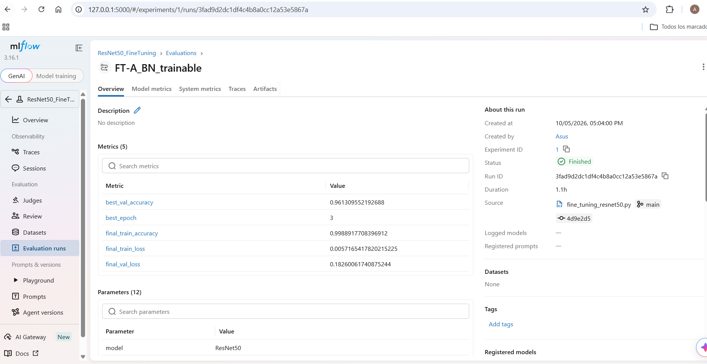
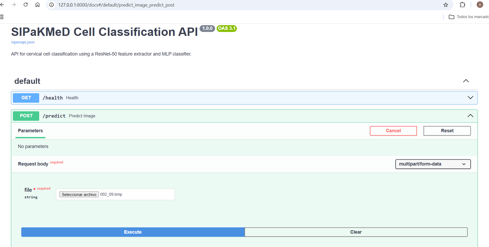

# End-to-End AI Computer Vision Pipeline with Deep Learning and MLOps

## Overview

This project implements an end-to-end computer vision pipeline for cervical cell classification using deep learning and machine learning, with a progressive MLOps workflow focused on reproducibility, experiment tracking, model versioning, API-based inference, and containerization.

The project uses the **SIPaKMeD** dataset and follows a modular architecture in which a pretrained **ResNet-50** is initially used as a deep feature extractor. A downstream classifier is selected through leakage-aware cross-validation, followed by systematic fine-tuning experiments, experiment tracking with MLflow, and deployment through FastAPI and Docker.

The current pipeline includes:

* Group-aware partitioning of the SIPaKMeD dataset.

* Prevention of data leakage by keeping cells from the same parent image within the same subset.

* Deep feature extraction using **ResNet-50 pretrained on ImageNet**.

* Extraction of 2,048-dimensional feature representations.

* Binary classification by grouping the original five cell categories into Normal and Abnormal classes.

* Comparison of MLP, SVM-RBF, and Random Forest classifiers.

* Five-fold `StratifiedGroupKFold` cross-validation on the development set.

* Selection of the initial downstream classifier using development-set performance only.

* Systematic fine-tuning of ResNet-50 using two Batch Normalization configurations.

* Comparison of fine-tuned feature representations using the same MLP classifier and identical cross-validation folds.

* Selection of the best fine-tuning configuration based on development performance and stability.

* Final training of the selected MLP using the complete development set.

* Independent evaluation on a previously unseen test set.

* Experiment tracking with **MLflow**.

* Logging of parameters, metrics, artifacts, training history, models, scalers, and evaluation results.

* FastAPI-based inference service.

* Docker containerization of the final inference pipeline.

* Versioned Docker images.

* Validation of the containerized service through `/health` and `/predict`.

The project is designed as a portfolio implementation demonstrating the transition from a deep learning model to a reproducible machine learning pipeline and, subsequently, to a tracked, API-based, and containerized inference service.

---

## Objectives

The main objectives of this project are:

* Build a reproducible computer vision classification pipeline using SIPaKMeD.

* Prevent data leakage through parent-image-level data partitioning.

* Use a pretrained **ResNet-50** model as a deep feature extractor.

* Compare different downstream classifiers using the same feature representation.

* Select the final classifier using only development data.

* Systematically evaluate alternative ResNet-50 fine-tuning configurations.

* Compare fine-tuned feature representations under identical classifier and validation conditions.

* Track experiments and artifacts using MLflow.

* Preserve the trained models and preprocessing components required for reproducible inference.

* Expose the trained pipeline through a FastAPI inference service.

* Containerize the inference service using Docker.

* Establish a foundation for CI/CD and inference monitoring.

---

# Dataset

## SIPaKMeD

The project uses the **SIPaKMeD** dataset, which contains five categories of cervical cell images:

| Cell type                |
| :----------------------- |
| Superficial/Intermediate |
| Parabasal                |
| Koilocytotic             |
| Metaplastic              |
| Dyskeratotic             |

The dataset contains **4,049 cell images** distributed across **271 parent images**.

## Binary Classification

The original five-class labels are preserved during data preparation, feature extraction, and ResNet-50 fine-tuning.

Binary relabeling is performed only during the downstream classification stage:

| Binary class | Original categories                     |
| :----------- | :-------------------------------------- |
| Normal       | Superficial/Intermediate, Parabasal     |
| Abnormal     | Koilocytotic, Metaplastic, Dyskeratotic |

This separation allows the ResNet feature representation to remain independent of the final binary classification task.

---

# Data Partitioning

The dataset is partitioned at the **parent-image level** to prevent data leakage.

Because multiple cell patches can originate from the same parent image, assigning individual cells independently to different subsets could result in visually related samples appearing in both development and test data.

A `GroupShuffleSplit` strategy is therefore used, with the parent image identifier serving as the grouping variable.

## Final Partition

| Subset           | Cell images | Parent images |  Proportion |
| :--------------- | ----------: | ------------: | ----------: |
| Development      |       3,379 |           230 |      83.45% |
| Independent Test |         670 |            41 |      16.55% |
| **Total**        |   **4,049** |       **271** | **100.00%** |

The target split was approximately 85% development and 15% test. Because partitioning was performed at the parent-image level, the resulting proportions are not exactly 85/15.

## Leakage Prevention

The final partition contains:

```text
Shared parent images between DEV and TEST: 0
```

Therefore, no cell originating from a parent image present in the development subset appears in the independent test subset.

---

# ResNet-50 Feature Extraction

A **ResNet-50 pretrained on ImageNet** is initially used as a frozen feature extractor.

The classification head is removed and Global Average Pooling is applied to obtain a 2,048-dimensional representation of each cell image.

```text
Input image
     ↓
ResNet-50 ImageNet
     ↓
Global Average Pooling
     ↓
2048-dimensional feature vector
```

The extracted representation contains:

```text
2048 features per cell image
```

The original metadata are retained together with the extracted features:

| Information     | Description                      |
| :-------------- | :------------------------------- |
| `filepath`      | Original image path              |
| `label`         | Original five-class label        |
| `group_id`      | Parent-image identifier          |
| feature columns | ResNet-50 feature representation |

The original dataset and generated feature files are excluded from version control.

---

# Initial Classifier Selection

After baseline feature extraction, three classifiers were evaluated using the same 2,048-dimensional representation:

* MLP

* SVM with RBF kernel

* Random Forest

The development set was evaluated using **five-fold `StratifiedGroupKFold` cross-validation**.

The folds preserve the parent-image grouping so that cells originating from the same parent image are not distributed across training and validation folds.

## Evaluation Metrics

The following metrics were used:

* Accuracy

* Precision (macro)

* Recall (macro)

* F1-score (macro)

## Cross-Validation Results

| Classifier    |            Accuracy |           Precision |              Recall |            F1-score |
| ------------- | ------------------: | ------------------: | ------------------: | ------------------: |
| **MLP**       | **0.9834 ± 0.0070** |     0.9827 ± 0.0066 | **0.9828 ± 0.0082** | **0.9827 ± 0.0073** |
| SVM-RBF       |     0.9825 ± 0.0089 | **0.9835 ± 0.0075** |     0.9802 ± 0.0109 |     0.9817 ± 0.0093 |
| Random Forest |     0.9591 ± 0.0086 |     0.9605 ± 0.0086 |     0.9547 ± 0.0099 |     0.9573 ± 0.0091 |

The **MLP was selected as the downstream classifier** because it achieved the highest mean Accuracy and F1-score across the development folds.

The independent test set was not used for this selection.

---

# Fine-Tuning ResNet-50

After establishing the baseline feature-extraction pipeline, two systematic fine-tuning configurations were evaluated.

Both configurations started from a fresh **ResNet-50 pretrained on ImageNet**.

The same fine-tuning boundary was used in both experiments:

```text
Frozen:

ResNet-50 through conv3_block4_out

Trainable:

conv4_x

conv5_x
```

A temporary five-class softmax classification head was used during fine-tuning.

The original five-class labels were retained during this stage.

## Fine-Tuning Validation Strategy

Fine-tuning was performed using the development set only.

A five-fold `StratifiedGroupKFold` partition was used to create an internal training and validation split for monitoring:

```text
Development set
     ↓
StratifiedGroupKFold
     ↓
Training: 2707 samples
Validation: 672 samples
```

The independent test set remained untouched.

Early stopping and restoration of the best validation weights were used based on validation accuracy.

Importantly, FT-A and FT-B were **not five independent fine-tuning runs**. The grouped cross-validation strategy was used to construct an internal validation split for monitoring the fine-tuning process.

---

# Fine-Tuning Configurations

## FT-A — Trainable Batch Normalization

FT-A uses:

* ResNet-50 ImageNet initialization

* Frozen layers through `conv3_block4_out`

* Trainable `conv4_x`

* Trainable `conv5_x`

* Trainable Batch Normalization layers in the trainable stages

* Five-class temporary softmax head

* Early stopping based on validation accuracy

Best validation accuracy:

```text
0.96131
```

The best result occurred at epoch 3.

The resulting model was saved as:

```text
models/resnet50/ft-a/resnet50_ft-a.keras
```

---

## FT-B — Frozen Batch Normalization

FT-B uses the same ResNet-50 initialization and freeze boundary, but Batch Normalization layers in the trainable stages remain frozen.

Configuration:

* ResNet-50 ImageNet initialization

* Frozen layers through `conv3_block4_out`

* Trainable `conv4_x`

* Trainable `conv5_x`

* Frozen Batch Normalization layers

* Five-class temporary softmax head

* Early stopping based on validation accuracy

Best validation accuracy:

```text
0.95982
```

The best result occurred at epoch 8.

The resulting model was saved as:

```text
models/resnet50/ft-b/resnet50_ft-b.keras
```

---

# MLflow Experiment Tracking

MLflow was integrated after the fine-tuning and classifier-selection stages to provide experiment tracking and reproducibility.

The project uses a local SQLite tracking backend:

```python
mlflow.set_tracking_uri("sqlite:///mlflow.db")
```

MLflow was selected to centralize experiment metadata instead of relying only on manually generated CSV files and console output.

The tracking database is local and is excluded from version control.

## MLflow Experiments

Three main MLflow experiments were created.

### 1. `ResNet50_FineTuning`

This experiment tracks the ResNet-50 fine-tuning experiments.

Runs include:

```text
FT-A_BN_trainable
FT-B_BN_frozen
```

Parameters and results tracked include:

* Fine-tuning configuration

* Frozen/trainable layers

* Batch Normalization configuration

* Training parameters

* Validation performance

* Best validation epoch

* Training history

* Fine-tuned model artifacts

The MLflow records make it possible to compare the two fine-tuning configurations without relying exclusively on terminal output.

---

### 2. `MLP_FT_Comparison`

After extracting features from FT-A and FT-B, both representations were evaluated using the **same MLP architecture and the same grouped cross-validation folds**.

This experiment was designed to answer:

> Which fine-tuned ResNet-50 representation produces the best downstream binary classification performance?

The comparison used:

* Identical MLP architecture

* Identical training configuration

* Identical five grouped folds

* Binary Normal/Abnormal labels

* StandardScaler fitted independently inside each training fold

* Accuracy

* Precision

* Recall

* F1-score

The resulting mean performance was:

| Configuration |            Accuracy |           Precision |              Recall |                  F1 |
| ------------- | ------------------: | ------------------: | ------------------: | ------------------: |
| **FT-A**      | **0.9988 ± 0.0013** | **0.9988 ± 0.0013** | **0.9988 ± 0.0013** | **0.9988 ± 0.0013** |
| FT-B          |     0.9982 ± 0.0033 |     0.9985 ± 0.0027 |     0.9978 ± 0.0040 |     0.9981 ± 0.0034 |

The fold-level Accuracy values were:

### FT-A

```text
0.9970
0.9985
0.9985
1.0000
1.0000
```

### FT-B

```text
0.9925
1.0000
1.0000
0.9985
1.0000
```

## Fine-Tuning Selection

FT-A was selected as the final fine-tuning configuration.

The selection was based on the predefined criterion:

1. Highest mean Accuracy

2. F1-score as a secondary criterion

3. Precision

4. Recall

FT-A achieved:

```text
Accuracy = 0.9988 ± 0.0013
```

compared with:

```text
FT-B Accuracy = 0.9982 ± 0.0033
```

FT-A also showed lower variability across folds.

Therefore, the final inference pipeline uses:

```text
ResNet-50 FT-A
```

rather than FT-B.

---

### MLflow Interface

The following screenshot shows the MLflow experiment-tracking interface, including the information registered for an experiment and its run.



---

# Final FT-A Classification Model

After selecting FT-A, a new final MLP was trained specifically on the FT-A feature representation.

The baseline MLP artifacts were **not reused**, because they were trained using the original ImageNet ResNet-50 features.

The final FT-A pipeline is:

```text
Input image
     ↓
ResNet-50 FT-A
     ↓
Global Average Pooling
     ↓
2048-dimensional feature vector
     ↓
StandardScaler
     ↓
MLP
     ↓
Normal / Abnormal
```

## MLP Architecture

```text
2048
  ↓
Dense(128, ReLU)
  ↓
Dense(64, ReLU)
  ↓
Dense(1, Sigmoid)
```

The value `2048` represents the **input dimensionality** of the ResNet-50 feature vector, not a hidden layer.

## Training Configuration

| Parameter           | Configuration        |
| ------------------- | -------------------- |
| Input features      | 2,048                |
| Hidden layer 1      | 128 neurons, ReLU    |
| Hidden layer 2      | 64 neurons, ReLU     |
| Output layer        | 1 neuron, Sigmoid    |
| Optimizer           | Adam                 |
| Loss                | Binary Cross-Entropy |
| Epochs              | 20                   |
| Batch size          | 32                   |
| Classification task | Normal vs. Abnormal  |

The scaler was fitted only on the complete development set.

The final MLP was then trained using all **3,379 development samples**.

The final artifacts are:

```text
models/
├── resnet50/
│   └── ft-a/
│       └── resnet50_ft-a.keras
└── mlp/
    ├── final_model_ft_a.keras
    └── scaler_ft_a.joblib
```

---

# Final Model Evaluation

The independent test set contains 670 cell images and was not used during classifier selection or fine-tuning model selection.

The final FT-A pipeline was evaluated once on the independent test set.

## Results

| Metric      |       TEST |
| ----------- | ---------: |
| Accuracy    | **0.9836** |
| Precision   | **0.9862** |
| Recall      | **0.9790** |
| Specificity | **0.9603** |
| F1-score    | **0.9824** |

## Confusion Matrix

```text
                 Predicted
              Normal  Abnormal
Actual Normal    242       10
       Abnormal    1      417
```

Therefore:

```text
TN = 242
FP = 10
FN = 1
TP = 417
```

The final model achieved an Accuracy of **98.36%** on the independent test set.

---

# MLflow Final Model Run

The final FT-A MLP training and evaluation were also logged to MLflow.

The experiment is:

```text
Final_Model_FT_A
```

with the run:

```text
Final_FT_A_MLP
```

The run records the final model configuration, test metrics, training history, model artifacts, scaler, ResNet-50 FT-A artifact, and confusion matrix.

This provides a traceable link between:

```text
Fine-tuning experiment
        ↓
FT-A / FT-B comparison
        ↓
FT-A selection
        ↓
Final MLP training
        ↓
Independent TEST evaluation
        ↓
Deployment artifacts
```

The final MLflow run ID is:

```text
82335b76ae1a4d83b50497ad8eb284b7
```

---

# FastAPI Inference Service

The final classification pipeline was exposed through a REST API using **FastAPI**.

The API uses the selected FT-A artifacts.

## Inference Architecture

```text
Client
  ↓
POST /predict
  ↓
FastAPI
  ↓
Temporary image
  ↓
ResNet-50 FT-A
  ↓
Global Average Pooling
  ↓
2048-dimensional feature vector
  ↓
StandardScaler FT-A
  ↓
Final FT-A MLP
  ↓
Normal / Abnormal
  ↓
JSON response
```

The fine-tuned ResNet-50 contains a temporary five-class classification head used during fine-tuning. During inference, that classification head is not used for the final binary decision.

Instead, the `GlobalAveragePooling2D` representation is extracted and passed to the FT-A scaler and MLP.

The inference module identifies the `GlobalAveragePooling2D` layer by layer type rather than relying on a hard-coded internal Keras layer name. This makes the feature-extraction logic more robust to automatically generated layer names.

## Inference Components

The inference logic is implemented in:

```text
src/inference.py
```

It is responsible for:

* Loading the FT-A ResNet-50 model.

* Locating the Global Average Pooling layer.

* Creating the 2,048-dimensional feature extractor.

* Loading the final FT-A MLP.

* Loading the FT-A StandardScaler.

* Preprocessing the input image.

* Extracting the 2,048-dimensional representation.

* Applying the same scaling used during final training.

* Generating the Normal/Abnormal prediction.

* Returning the prediction probability.

The API layer is implemented in:

```text
api/main.py
```

---

# API Endpoints

## `GET /health`

Used to verify that the service is operational.

Example:

```json
{
  "status": "ok"
}
```

## `POST /predict`

Receives an uploaded image and returns the model prediction.

Example:

```json
{
  "prediction": "Normal",
  "class_id": 0,
  "probability": 5.57989653440634e-09
}
```

The uploaded image is stored temporarily inside the execution environment and removed after inference.

## Swagger UI

FastAPI automatically generates interactive API documentation through Swagger UI.

When running locally:

```text
http://127.0.0.1:8000/docs
```

The API was tested by uploading SIPaKMeD images through Swagger UI.

The following screenshot shows the API being used through Swagger UI during the containerized inference workflow.



---

# Docker Containerization

The FastAPI inference service was containerized using **Docker**.

The objective is to package the inference code, Python environment, dependencies, and exact trained artifacts required for prediction into a reproducible executable image.

The final architecture is:

```text
Client
  ↓
localhost:8000
  ↓
Docker container
  ↓
Uvicorn
  ↓
FastAPI
  ↓
ResNet-50 FT-A
  ↓
StandardScaler
  ↓
Final FT-A MLP
```

## Dockerfile

The image uses:

```text
python:3.12-slim
```

and installs the dependencies listed in:

```text
requirements.txt
```

Only the artifacts required for inference are copied into the image:

```text
api/
└── main.py

src/
└── inference.py

models/
├── resnet50/
│   └── ft-a/
│       └── resnet50_ft-a.keras
└── mlp/
    ├── final_model_ft_a.keras
    └── scaler_ft_a.joblib
```

Training datasets, generated features, MLflow tracking data, experimental results, and unrelated model versions are not required by the inference container.

---

# Docker Image Versions

Three Docker image versions were created during development.

## Version 1.0

```text
sipakmed-api:1.0
```

The first image successfully packaged and executed the FastAPI inference service.

During testing, the container downloaded the ResNet-50 ImageNet weights when the model was initialized.

This revealed an external runtime dependency that should be avoided in a self-contained deployment.

---

## Version 1.1

```text
sipakmed-api:1.1
```

Version 1.1 addressed the ImageNet weight dependency by initializing ResNet-50 during the Docker image build.

This caused the ImageNet weights to be downloaded during `docker build` rather than during container startup.

The approach made the container more self-contained, but the architecture still used the baseline ImageNet ResNet-50 inference pipeline.

---

# Version 1.2 — Final FT-A Inference Image

```text
sipakmed-api:1.2
```

Version 1.2 updates the inference service to use the selected **FT-A fine-tuned ResNet-50** and its corresponding downstream artifacts.

The Dockerfile no longer needs to initialize a separate ImageNet ResNet-50 or download ImageNet weights.

The fine-tuned model is already stored in:

```text
models/resnet50/ft-a/resnet50_ft-a.keras
```

and is copied directly into the image.

The final image includes only the three trained artifacts required for inference:

```text
resnet50_ft-a.keras

final_model_ft_a.keras

scaler_ft_a.joblib
```

The Docker image was successfully built using:

```powershell
docker build -t sipakmed-api:1.2 .
```

The resulting image was then executed with:

```powershell
docker run --name sipakmed-api-1.2 -p 8000:8000 sipakmed-api:1.2
```

The container started successfully with Uvicorn listening on:

```text
http://0.0.0.0:8000
```

---

# Docker Validation

The final `sipakmed-api:1.2` container was validated through the actual inference endpoints.

## Health Check

The endpoint:

```text
GET /health
```

returned:

```json
{
  "status": "ok"
}
```

with HTTP status `200`.

## Prediction Test

The `/predict` endpoint was tested through Swagger UI by uploading a real SIPaKMeD image.

The container returned a valid JSON prediction:

```json
{
  "prediction": "Abnormal",
  "class_id": 1,
  "probability": 1
}
```

with HTTP status `200`.

This confirms that the complete FT-A inference pipeline was successfully executed inside the Docker container:

```text
Uploaded image
      ↓
FastAPI
      ↓
ResNet-50 FT-A
      ↓
2048 features
      ↓
FT-A StandardScaler
      ↓
FT-A MLP
      ↓
Binary prediction
```

---

# Docker Layer and Artifact Strategy

The Docker build was also used to verify that only the inference components are required at runtime.

The project deliberately separates:

### Development artifacts

```text
data/
results/
mlflow.db
mlruns/
training scripts
experimental feature files
```

from:

### Deployment artifacts

```text
api/main.py
src/inference.py
resnet50_ft-a.keras
final_model_ft_a.keras
scaler_ft_a.joblib
requirements.txt
```

This separation makes the deployment image smaller and avoids coupling the production inference service to the complete experimentation environment.

---

# Current Project Structure

```text
project-04-ai-computer-vision-mlops/
│
├── api/
│   └── main.py
│
├── data/
│   ├── splits/
│   │   ├── dev_data.csv
│   │   └── test_data.csv
│   │
│   └── features/
│       ├── dev_features_resnet50.csv
│       ├── test_features_resnet50.csv
│       ├── dev_features_resnet50_ft_a.csv
│       ├── test_features_resnet50_ft_a.csv
│       ├── dev_features_resnet50_ft_b.csv
│       └── test_features_resnet50_ft_b.csv
│
├── images/
│   ├── mlflow_experiment.png
│   └── swagger_docker.png
│
├── models/
│   ├── mlp/
│   │   ├── final_model.keras
│   │   ├── scaler.joblib
│   │   ├── final_model_ft_a.keras
│   │   └── scaler_ft_a.joblib
│   │
│   └── resnet50/
│       ├── ft-a/
│       │   └── resnet50_ft-a.keras
│       └── ft-b/
│           └── resnet50_ft-b.keras
│
├── results/
│   ├── classification/
│   ├── ft_comparison/
│   └── final_ft_a/
│
├── src/
│   ├── Data_Split_lists.py
│   ├── feature_extraction_resnet50.py
│   ├── classification_model_selection.py
│   ├── train_final_classifier.py
│   ├── fine_tuning_resnet50.py
│   ├── classification_ft_comparison.py
│   ├── train_final_classifier_ft_a.py
│   ├── extract_ft_b_features.py
│   └── inference.py
│
├── .dockerignore
├── .gitignore
├── Dockerfile
├── README.md
└── requirements.txt
```

Generated datasets, features, trained models, MLflow databases, and experimental results are excluded from version control through `.gitignore`.

The screenshots stored in `images/` are intentionally included in version control because they are part of the project documentation.

---

# MLOps Workflow

The current workflow can be summarized as:

```text
SIPaKMeD
    ↓
Parent-image-level split
    ↓
Leakage prevention
    ↓
ResNet-50 ImageNet feature extraction
    ↓
MLP / SVM-RBF / Random Forest comparison
    ↓
MLP selected
    ↓
ResNet-50 fine-tuning
    ├── FT-A: BN trainable
    └── FT-B: BN frozen
    ↓
Feature extraction
    ↓
FT-A / FT-B MLP comparison
    ↓
FT-A selected
    ↓
Final MLP training
    ↓
Independent TEST evaluation
    ↓
MLflow tracking
    ↓
FastAPI
    ↓
Docker 1.2
    ↓
Container validation
```

This workflow separates model development from deployment and maintains the independent test set as the final evaluation reference.

---

# MLOps Roadmap

## Completed

* [x] Dataset preparation

* [x] Parent-image-level data partitioning

* [x] Data leakage prevention

* [x] ResNet-50 ImageNet feature extraction

* [x] Baseline classifier comparison

* [x] MLP classifier selection

* [x] ResNet-50 FT-A fine-tuning

* [x] ResNet-50 FT-B fine-tuning

* [x] FT-A / FT-B feature comparison

* [x] Final fine-tuning selection

* [x] Final FT-A MLP training

* [x] Independent TEST evaluation

* [x] Model and scaler artifact generation

* [x] MLflow experiment tracking

* [x] MLflow model and artifact logging

* [x] FastAPI inference service

* [x] API endpoint validation

* [x] Docker containerization

* [x] Docker image versioning

* [x] Final FT-A Docker image

* [x] Containerized inference validation

## Planned

* [ ] CI/CD automation

* [ ] Basic inference monitoring

* [ ] Deployment to a remote environment

---

# Technologies

| Technology         | Role                                                                         |
| ------------------ | ---------------------------------------------------------------------------- |
| Python             | Main programming language                                                    |
| TensorFlow / Keras | ResNet-50 fine-tuning, feature extraction, and MLP                           |
| scikit-learn       | Data splitting, grouped cross-validation, scaling, and classical classifiers |
| Pandas             | Dataset and feature management                                               |
| NumPy              | Numerical computation                                                        |
| Joblib             | Scaler persistence                                                           |
| Pillow             | Image loading and preprocessing                                              |
| FastAPI            | Inference API                                                                |
| Uvicorn            | ASGI server                                                                  |
| python-multipart   | Multipart image upload handling                                              |
| Docker             | Containerization and reproducible inference                                  |
| MLflow             | Experiment tracking, metrics, artifacts, and model management                |
| Git                | Version control                                                              |
| GitHub             | Source-code repository                                                       |
| GitHub Actions     | Planned CI/CD                                                                |

---

# Status

**Current status: End-to-end classification, experiment tracking, FastAPI inference, and Docker containerization completed.**

The project has progressed from SIPaKMeD data preparation and deep feature extraction to:

1. Leakage-aware classifier selection.

2. Systematic ResNet-50 fine-tuning.

3. Comparison of alternative fine-tuning configurations.

4. Selection of the FT-A configuration.

5. Final binary MLP training.

6. Independent test evaluation.

7. MLflow-based experiment tracking.

8. FastAPI inference.

9. Dockerized deployment.

10. Validation of the final containerized inference service.

The selected production-style inference pipeline is:

```text
ResNet-50 FT-A
      ↓
2048 features
      ↓
StandardScaler
      ↓
MLP
      ↓
Normal / Abnormal
```

The final model achieved:

```text
TEST Accuracy: 0.9836
TEST F1:       0.9824
```

The final Docker image is:

```text
sipakmed-api:1.2
```

The project is now ready to move to the next MLOps stage: **CI/CD automation and basic inference monitoring**.

---

# Author

**Alejandro Reyes Morales**

AI / Computer Vision / Machine Learning
